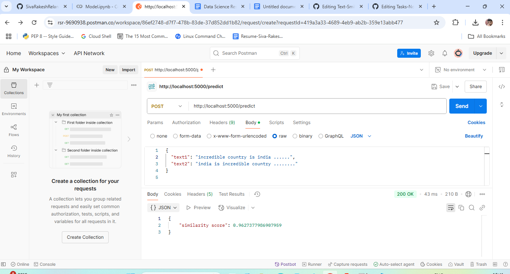

# 🧠 Semantic Text Similarity API 
Deployed Link on Render : [https://similaritytextscorerender.onrender.com/](https://similaritytextscorerender.onrender.com/)

A lightweight Flask-based REST API that computes the **semantic similarity** between two text inputs using a pre-trained SentenceTransformer model (`paraphrase-MiniLM-L3-v2`). 

This API returns a score between `0` and `1`, where:
- `1.0` means the texts are **highly similar**
- `0.0` means the texts are **completely different**

---

## 🚀 Live API Link

> 🔗 [https://similaritytextscorerender.onrender.com/predict](https://similaritytextscorerender.onrender.com/predict)
---

## 📦 Features

- ✅ Semantic similarity using Sentence-BERT
- ✅ REST API with Flask
- ✅ Lightweight model for fast deployment (`paraphrase-MiniLM-L3-v2`)
- ✅ Free deployment on [Render](https://render.com)
- ✅ Supports POST request with clean JSON interface

---

## 📥 API Usage

### `POST /predict`
Use POST Method and ENDPOINT API --> https://similaritytextscorerender.onrender.com/predict

**Request:**

```bash
{
  "text1": "AI is transforming the world.",
  "text2": "Artificial intelligence is changing everything."
}
```

**Response**
```bash
{
  "similarity score": 0.5534336566925049
}
```


## How to use API Just follow these Steps
 #### Download files app.py and requirements.txt
## Setup Instructions
1. **Set Up Virtual Environment**:
   ```bash
   conda create -p envtext python=3.13 -y

   


2. **Activate Environment**:
   ```bash
   conda activate ./envtext

3. **Install Dependencies**:
   ```bash
   pip install -r requirements.txt


3. **Run python**:
   ```bash
   python app.py


5. **Open the postman and API URL is:**:
   ```bash
   http://127.0.0.1:5000/predict



